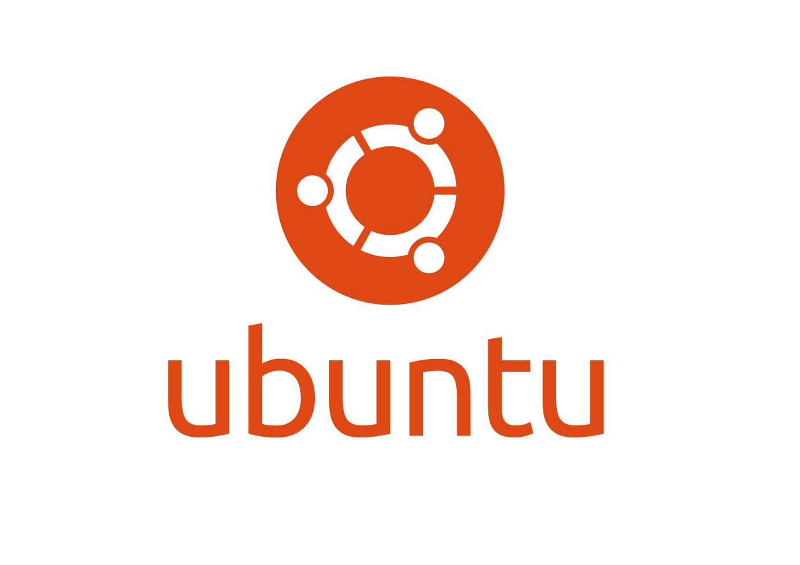
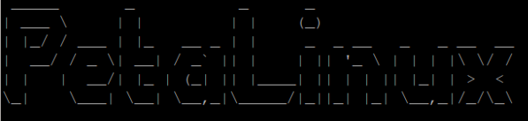
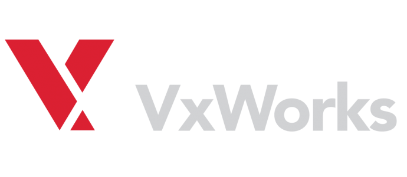

# Table of Content
1. [TySOM](#tysom_main)
   - [Vitis-platforms](#tysom_vitis_platforms)
   - [SDx-platforms](#tysom_sdx_platforms)
     - [How to use TySOM platform with SDx](#tysom_sdx_platform_use)
   - [Vivado - board definition files](#tysom_board_def_files)
   - [PetaLinux - BSP](#tysom_petalinux_bsp)
   - [Supported OSes](#tysom_supported_os)
     - [Ubuntu-Linaro](#ubuntu_linaro_os)
     - [Debian-Linaro](#debian_linaro_os)
     - [Yocto Project](#yocto_project_os)
     - [Petalinux tools](#petalinux_os)
     - [VxWorks](#vxworks_os)
     - [freeRTOS](#freertos_os)
     - [OpenWrt](#openwrt_os)
   - [Yocto Project configurations](#yocto_project_cfg)

<a name="tysom_main"/>

# TySOM

TySOM is a family of development boards for embedded applications that features Xilinx® Zynq™ all programmable module combining FPGA with ARM® Cortex processor. Plethora of included peripherals makes these boards useful in various embedded applications like Automotive, IoT, Industrial automation or embedded HPC.

Aldec provides the following list of boards:
-	[TySOM-3A (Xilinx Zynq UltraScale+ ZU19EG)](https://www.aldec.com/en/products/emulation/tysom_boards/zynq_ultrascale_mpsoc_boards/tysom_3a)

[GitHub Link](https://github.com/aldec/TySOM-3A-ZU19EG)
-	[TySOM-3 (Xilinx Zynq UltraScale+ ZU7EV)](https://www.aldec.com/en/products/emulation/tysom_boards/zynq_ultrascale_mpsoc_boards/tysom_3)

[GitHub Link](https://github.com/aldec/TySOM-3-ZU7EV)
-	[TySOM-2 (Xilinx Zynq XC7Z045 or XC7Z100)](https://www.aldec.com/en/products/emulation/tysom_boards/zynq_7000/tysom_2)

[GitHub Link](https://github.com/aldec/TySOM-2-7Z100)
-	[TySOM-2A (Xilinx Zynq XC7Z030)](https://www.aldec.com/en/products/emulation/tysom_boards/zynq_7000/tysom_2a)

[GitHub Link](https://github.com/aldec/TySOM-2A-7Z030)
-	[TySOM-1 (Xilinx Zynq XC7Z030)](https://www.aldec.com/en/products/emulation/tysom_boards/zynq_7000/tysom_1)

[GitHub Link](https://github.com/aldec/TySOM-1-7Z030)
-	[TySOM-1A (Xilinx Zynq XC7Z010)](https://www.aldec.com/en/products/emulation/tysom_boards/zynq_7000/tysom_1a)

[GitHub Link](https://github.com/aldec/TySOM-1A-7Z010)

[Link to the TySOM boards page](https://www.aldec.com/en/products/emulation/tysom_boards)

TySOM-3A, TySOM-3, TySOM-2 and TySOM-2A families contain FMC connectors which can be used to extend devices and peripherals not included in TySOM boards. Due to non-proprietary connectors like FMC Daughter Cards can be reused across different hardware platforms.

Daughter Cards provided by Aldec:
-	[FMC-ADAS](https://www.aldec.com/en/products/emulation/daughter_cards/fmc_daughter/fmc_adas)
-	[FMC-INDUSTRY](https://www.aldec.com/en/products/emulation/daughter_cards/fmc_daughter/fmc_industry)
-	[FMC-INTF](https://www.aldec.com/en/products/emulation/daughter_cards/fmc_daughter/fmc_intf)
-	[FMC-IOT](https://www.aldec.com/en/products/emulation/daughter_cards/fmc_daughter/fmc_iot)
-	[FMC-NET](https://www.aldec.com/en/products/emulation/daughter_cards/fmc_daughter/fmc_net)
-	[FMC-QSFP](https://www.aldec.com/en/products/emulation/daughter_cards/fmc_daughter/fmc_qsfp)
-	[FMC-NVMe](https://www.aldec.com/en/products/emulation/daughter_cards/fmc_daughter/fmc_nvme)
-	[FMC-VISION](https://www.aldec.com/en/products/emulation/daughter_cards/fmc_daughter/fmc_vision)

[GitHub Link](https://github.com/aldec/FMC-cards)

<a name="tysom_vitis_platforms"/>

## Vitis-Platforms

A collection of configuration platforms for Xilinx Vitis tool that help customers use Aldec TySOm board with Vitis to accelerate algorithms in Zynq FPGA chip.

<a name="tysom_sdx_platforms"/>

## SDx-platforms

A collection of configuration platforms for Xilinx SDx tool that help customers use Aldec TySOM board with SDx to accelerate algorithms in Zynq FPGA chip.

>**Note: These platforms have to be downloaded and a zip file has to be extracted on Linux. SDx platform extracted on Windows will not work!**

> Note: Provided SDx platforms use Chroma Resampler and On-Screen Display IP cores from LogicCORE. This is why additional licenses are required.

<a name="tysom_sdx_platform_use"/>

### How to use TySOM platform with SDx

To use Aldec TySOM board with Xilinx SDx tool an appropriate SDx platform need to be used. Download the platform for TySOM board and follow [Xilinx instruction](https://www.xilinx.com/support/documentation/sw_manuals/xilinx2017_4/ug1027-sdsoc-user-guide.pdf)

In **Choose Hardware Platform** window user has to add TySOM platform by using **Add Custom Platform** button. Next step is to select the platform.

See **Appendix B: Managing Platforms and Repositories** of Xilinx instruction for more information.

[Document](https://github.com/aldec/TySOM-3A-ZU19EG/blob/master/SDx-platforms/How_to_use_Aldec_TySOM_board_in_Xilinx_SDx.pdf) contains all necessary information about using Aldec TySOM board in Xilinx SDx tool.

<a name="tysom_board_def_files"/>

## Vivado - board definition files

Vivado board definition files contain configuration of Processing System and interfaces available on the board to simplify using the Aldec TySOM board in Xilinx Vivado tool.

The board definition files for all TySOM boards can be found in Vivado-board_files folder.

[Document](https://github.com/aldec/TySOM-3A-ZU19EG/blob/master/Vivado-board_files/How_to_build_an_FPGA_design_for_Aldec_TySOM_boards_using_board_definition_in_Xilinx_Vivado.pdf) contains all necessary information about using Aldec TySOM board in Xilinx Vivado tool with the board definition files.

The board definition files are provided for the following Aldec TySOM boards:
-	[TySOM-3A (Xilinx Zynq UltraScale+ ZU19EG)](https://www.aldec.com/en/products/emulation/tysom_boards/zynq_ultrascale_mpsoc_boards/tysom_3a)

[GitHub Link](https://github.com/aldec/TySOM-3A-ZU19EG)
-	[TySOM-3 (Xilinx Zynq UltraScale+ ZU7EV)](https://www.aldec.com/en/products/emulation/tysom_boards/zynq_ultrascale_mpsoc_boards/tysom_3)

[GitHub Link](https://github.com/aldec/TySOM-3-ZU7EV)
-	[TySOM-2 (Xilinx Zynq XC7Z045 or XC7Z100)](https://www.aldec.com/en/products/emulation/tysom_boards/zynq_7000/tysom_2)

[GitHub Link](https://github.com/aldec/TySOM-2-7Z100)
-	[TySOM-2A (Xilinx Zynq XC7Z030)](https://www.aldec.com/en/products/emulation/tysom_boards/zynq_7000/tysom_2a)

[GitHub Link](https://github.com/aldec/TySOM-2A-7Z030)
-	[TySOM-1 (Xilinx Zynq XC7Z030)](https://www.aldec.com/en/products/emulation/tysom_boards/zynq_7000/tysom_1)

[GitHub Link](https://github.com/aldec/TySOM-1-7Z030)
-	[TySOM-1A (Xilinx Zynq XC7Z010)](https://www.aldec.com/en/products/emulation/tysom_boards/zynq_7000/tysom_1a)

[GitHub Link](https://github.com/aldec/TySOM-1A-7Z010)

The board definition files contain also FMC cards definitions:
-	[FMC-ADAS](https://www.aldec.com/en/products/emulation/daughter_cards/fmc_daughter/fmc_adas)
-	[FMC-INDUSTRY](https://www.aldec.com/en/products/emulation/daughter_cards/fmc_daughter/fmc_industry)
-	[FMC-INTF](https://www.aldec.com/en/products/emulation/daughter_cards/fmc_daughter/fmc_intf)
-	[FMC-IOT](https://www.aldec.com/en/products/emulation/daughter_cards/fmc_daughter/fmc_iot)
-	[FMC-NET](https://www.aldec.com/en/products/emulation/daughter_cards/fmc_daughter/fmc_net)
-	[FMC-QSFP](https://www.aldec.com/en/products/emulation/daughter_cards/fmc_daughter/fmc_qsfp)
-	[FMC-NVMe](https://www.aldec.com/en/products/emulation/daughter_cards/fmc_daughter/fmc_nvme)

[GitHub Link](https://github.com/aldec/FMC-cards)

<a name="tysom_petalinux_bsp"/>

## PetaLinux - BSP

Many embedded hardware platforms require small-sized embedded Linux OS and filesystem.
Aldec TySOM boards which based on Xilinx Zynq can be used in any embedded systems.
For this purpose, Xilinx PetaLinux tools can be used to generate a custom filesystem image with additional built-in libraries, applications and system tools.

The board definition files for TySOM boards can be found in Petalinux_BSP folder.

[Document](https://github.com/aldec/TySOM-3A-ZU19EG/blob/master/Petalinux_BSP/Preparing_Custom_Linux_Boot_Files_with_Xilinx_Petalinux_Tools.pdf) contains all necessary information about building PetaLinux OS and filesystem for TySOM boards.

The PetaLinux BSP files are provided for the following Aldec TySOM boards:
-	[TySOM-3A (Xilinx Zynq UltraScale+ ZU19EG)](https://www.aldec.com/en/products/emulation/tysom_boards/zynq_ultrascale_mpsoc_boards/tysom_3a)

[GitHub Link](https://github.com/aldec/TySOM-3A-ZU19EG)
-	[TySOM-3 (Xilinx Zynq UltraScale+ ZU7EV)](https://www.aldec.com/en/products/emulation/tysom_boards/zynq_ultrascale_mpsoc_boards/tysom_3)

[GitHub Link](https://github.com/aldec/TySOM-3-ZU7EV)

The PetaLinux BSP files are provided for the following PetaLinux versions:
- 2018.3

<a name="tysom_supported_os"/>

## Supported OSes

All Aldec TySOM boards were checked with different Operating Systems.
Below is a list of supported OSes and additional information.

---

<a name="ubuntu_linaro_os"/>

1. Ubuntu-Linaro

A stock version of Ubuntu Desktop Operating System with additional packages from Linaro. It supports all standard interfaces such as: USB, HDMI, Ethernet, WiFi, Audio IN/OUT.

Filesystem Version: 20121124-560

- [Linaro webpage](https://www.linaro.org/)

---

<a name="debian_linaro_os"/>

2. Debian-Linaro

A Linaro version of Debian Linux System with support of standard interfaces: USB, HDMI, Ethernet, WiFi, Audio IN/OUT

Kernel version: 4.4

Filesystem Version: 20160329-17

- [Linaro webpage](https://www.linaro.org/)

- [Instruction how to build](https://www.aldec.com/en/downloads/private/940)

---

<a name="yocto_project_os"/>

3. Linux OS build system: Yocto Project

Yocto project provides all necessary functions and scripts to build a custom Linux Operating system.

- [Yocto Project webpage](https://www.yoctoproject.org/)

- [Instruction how to build](https://www.aldec.com/en/downloads/private/903)

---

<a name="petalinux_os"/>

4. Linux OS build system: Petalinux tools

The Petalinux provides all necessary tools to build a custom operating system for Embedded solutions for board with Xilinx Zynq chips.

Kernel version: 4.9

Filesystem Version: 2017.2

- [Xilinx webpage](https://www.xilinx.com/products/design-tools/embedded-software/petalinux-sdk.html)

---

<a name="vxworks_os"/>

5. VxWorks

The VxWorks is an industry’s real-time operating system which provides a set of very important features such as: safety and security.

VxWorks version: 7

- [VxWorks webpage](https://www.windriver.com/products/vxworks/)

---

<a name="freertos_os"/>

6. freeRTOS

The most popular, free real-time operating system for embedded devices.

freeRTOS version: 8.2.3

- [freeRTOS webpage](https://www.freertos.org/)

---

<a name="openwrt_os"/>

7. OpenWrt

The OpenWrt is a GNU/Linux distribution for embedded devices such as wireless routers. It is built to be easily modifiable operating system for routers.

Kernel version: 4.4.14

OpenWrt version: 15.05.1

- [OpenWrt webpage](https://openwrt.org/)

---

<a name="yocto_project_cfg"/>

## Yocto Project configurations

[The Yocto Project](https://www.yoctoproject.org/) is an open source project to help developers creating a custom Linux-based systems.

Aldec provides configuration for Yocto project for the following list of boards:
-	[TySOM-3A (Xilinx Zynq UltraScale+ ZU19EG)](https://www.aldec.com/en/products/emulation/tysom_boards/zynq_ultrascale_mpsoc_boards/tysom_3a)

[GitHub Link](https://github.com/aldec/TySOM-3A-ZU19EG)
-	[TySOM-3 (Xilinx Zynq UltraScale+ ZU7EV)](https://www.aldec.com/en/products/emulation/tysom_boards/zynq_ultrascale_mpsoc_boards/tysom_3)

[GitHub Link](https://github.com/aldec/TySOM-3-ZU7EV)

[Document](https://github.com/aldec/TySOM-3A-ZU19EG/blob/master/Yocto_Project/How_to_configure_and_build_Linux_OS_with_Yocto_project.pdf) contains all necessary information about using the Yocto Project to build a custom Linux for the boards.
